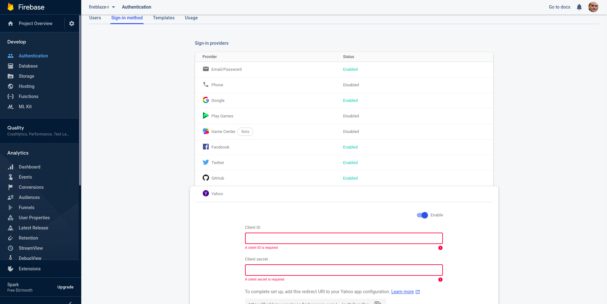

# Oauth Providers

You might have already browsed the [guide on social sign in](/auth/social.md). They are in fact convenience wrapper to the more general "Oauth providers" class. It works in a very similar fashion and can even prove more convenient.

## R Package

First, instantiate the authentication from `FirebaseOauthProviders`, then define the provider you want to use with `set_provider`, finally `launch` whenever you want.

Below we have the authentication launch at the click of a button. We provide Microsoft by simply setting `microsoft.com` as provider. All that is needed to change to say Yahoo! is to change the provider to `yahoo.com` for instance.

```r
library(shiny)
library(firebase)

ui <- fluidPage(
  useFirebase(),
  actionButton("signin", "Sign in with Microsoft", icon = icon("microsoft")),
  plotOutput("plot")
)

server <- function(input, output, session){
  f <- FirebaseOauthProviders$
    new()$
    set_provider("microsoft.com")

  observeEvent(input$signin, {
    f$launch()
  })

  output$plot <- renderPlot({
    f$req_sign_in()
    plot(cars)
  })
  
}

shinyApp(ui, server)
```

## Console Setup

The R-side of things is rather easy so here we briefly explain how to integrate those oauth providers with the Firebase console.

### :material-yahoo: Yahoo

For Yahoo it is fairly straightforward. Open you console under "Sign-in method" tab and enable Yahoo! as show below. 



To get the necessary app ID and app secret visit [this link](https://developer.yahoo.com/apps/create/) and create an app 


!!! tip "Redirect URL"
    Make sure you enter the "Redirect URI(s)" given to you by Firebase which resembles 
    `https://my-application.firebaseapp.com/__/auth/handler` 
    and tick the `OpenID Connect Permissions` at the bottom.

On the resulting screen copy the app ID and secret to your Firebase console.

### :material-microsoft: Microsoft

Authenticating via Microsoft is handled by Microsoft Azure, create a free account if you do not have one the:

1. Visit [the portal](https://portal.azure.com/)
2. Search and select “Azure Active Directory”
3. In the left sidebar under “Manage” select “App registrations”
4. Then click New registrations
5. Under API permissions give "User.Read" permissions to Microsoft Graph API.
6. Under “Redirect URI” select “Web” and place the redirect URL given by Firebase
7. Once created, on the “overview” screen copy the “Application (client) ID” to
Firebase (find it within the firebase console under microsoft Sign-in method )
8. Then visit “Certificates & secrets” in the sidebar
9. Create a “New client secret” and copy it (watch out you need to copy the
"Value" not the "Secret ID" field) to Firebase (within the firebase console
microsoft Sign-in method under "Application secret")

Once this done give Microsoft 2 minutes to sync before trying the authentication.
