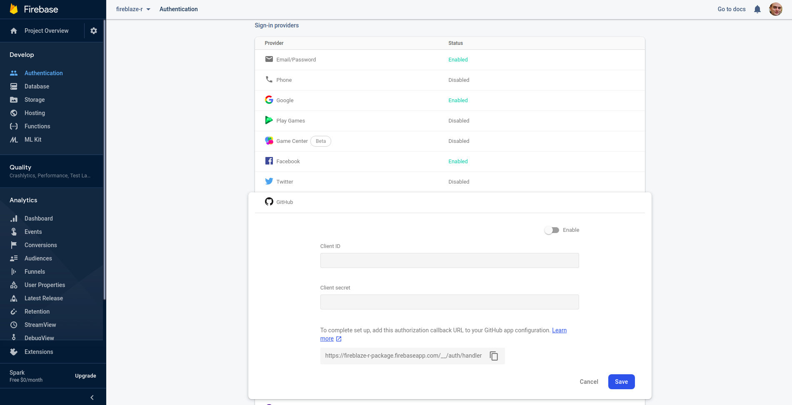
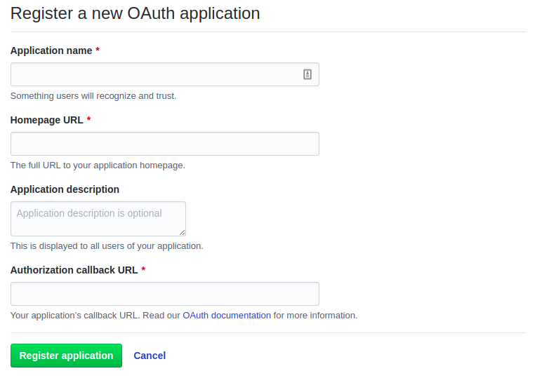

# Social

Google Firebase integrates nicely with multiple social sites so users can easily login via:

* :material-google: Google
* :material-github: Github
* :material-facebook: Facebook 
* :material-twitter: Twitter

## Console

First, these need to be setup in the Firebase console. If you followed the [get started guide](/guide/get-started/) you should already have enabled Google. Now we'll setup Github!

1. Head over to the [Firebase console](https://console.firebase.google.com/)
2. Go to your project
3. Open the "Authentication" <i class="fa fa-users"></i> in the top left
4. Visit the second tab "Sign-in method"
5. Select "Github"

This should present you with the screen below.



It prompts you to enable it and enter your app id and app secret; _notice the redirect url at the bottom of that box_. These are taken from a Github OAuth application: follow [this link](https://github.com/settings/applications/new) to create yours and fill in the form.

!!! warning "Callback URL"
    Make sure you enter the "Authorization callback URL" given to you
    by Firebase which resembles 
    `https://my-application.firebaseapp.com/__/auth/handler`



## Package

Once setup in the Firebase console you can use those social services in your shiny app. Let's create a basic shiny app that prompts the user to login on load; we'll provide . Remember to import the dependencies in the UI with `useFirebase`.

```r
library(shiny)
library(firebase)

# define signin
signin <- modalDialog(
  title = "Login",
  actionButton("google", "Google", icon = icon("google"), class = "btn-danger"),
  actionButton("github", "Github", icon = icon("github")),
  footer = NULL
)

ui <- fluidPage(
  useFirebase() # import dependencies
)

server <- function(input, output) {
  showModal(signin)
}

shinyApp(ui, server)
```

We are then going to initialise the authentication from the `FirebaseSocial` object.

```r
library(shiny)
library(firebase)

# define signin
signin <- modalDialog(
  title = "Login",
  actionButton("google", "Google", icon = icon("google"), class = "btn-danger"),
  actionButton("github", "Github", icon = icon("github")),
  footer = NULL
)

ui <- fluidPage(
  useFirebase()
)

server <- function(input, output) {
  showModal(signin)
  f <- FirebaseSocial$new()
}

shinyApp(ui, server)
```

Finally, we can bind our buttons to actual sign in triggers. We do so with the different `launch_*` methods.

```r
library(shiny)
library(firebase)

# define signin
signin <- modalDialog(
  title = "Login",
  actionButton("google", "Google", icon = icon("google"), class = "btn-danger"),
  actionButton("github", "Github", icon = icon("github")),
  footer = NULL
)

ui <- fluidPage(
  useFirebase()
)

server <- function(input, output) {
  showModal(signin)

  f <- FirebaseSocial$new()

  observeEvent(input$google, {
    f$launch_google()
  })

  observeEvent(input$github, {
    f$launch_github()
  })
}

shinyApp(ui, server)
```


Then again, we use the method `req_sign_in` to indicate observers and output that require the user to be logged in. Below we use the latter to remove the modal and display a plot.

```r
library(shiny)
library(firebase)

# define signin
signin <- modalDialog(
  title = "Login",
  actionButton("google", "Google", icon = icon("google"), class = "btn-danger"),
  actionButton("github", "Github", icon = icon("github")),
  footer = NULL
)

ui <- fluidPage(
  useFirebase(),
  plotOutput("plot")
)

server <- function(input, output) {
  showModal(signin)

  f <- FirebaseSocial$new()

  observeEvent(input$google, {
    f$launch_google()
  })

  observeEvent(input$github, {
    f$launch_github()
  })

  observe({
    f$req_sign_in()
    removeModal()
  })

  output$plot <- renderPlot({
    f$req_sign_in()
    plot(cars)
  })
}

shinyApp(ui, server)
```


