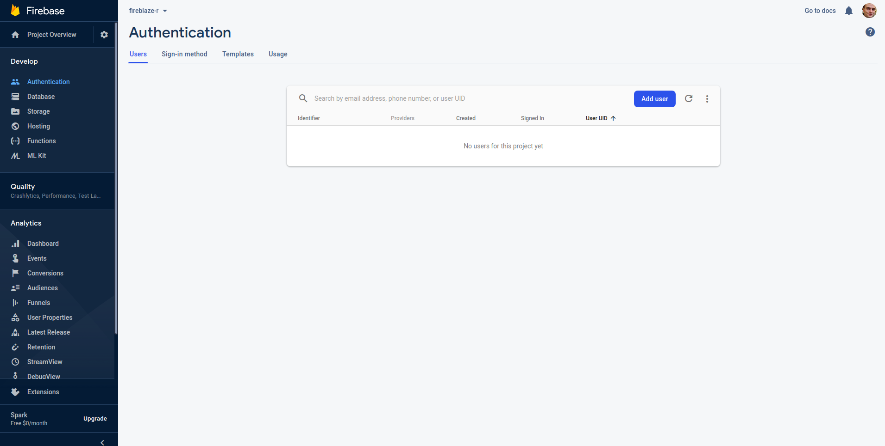

# Pre-built UI

The easiest way to provide Shiny authentication with {firebase} is probably using the prebuilt UI put together by Google itself.

We first configure the UI to include the sign-in services we want to enable, we launch the authentication service (together with the UI), then observe the user's interactions with the UI; sign-up success or failure.

## Introduction

To demonstrate we will build an application that allows users to sign-up/sign-in. The very thing we do is place `useFirebase` in the Shiny UI, making sure you also place `useFirebaseUI` in there. This imports the necessary dependencies., without it nothing will work.

```r
library(shiny)
library(firebase)

ui <- fluidPage(
  useFirebase(), # import dependencies
  useFirebaseUI() # import UI
)

server <- function(input, output){}

shinyApp(ui, server)
```

Next we will instantiate the authentication service. We do so by calling the `new` method on the `FirebaseUI` object.

```r
library(shiny)
library(firebase)

ui <- fluidPage(
  useFirebase(), # import dependencies
  useFirebaseUI() # import UI
)

server <- function(input, output){
  f <- FirebaseUI$new() # instantiate
}

shinyApp(ui, server)
```

Using that object `f` we just created we can configure our sign-up/sign-in options. There is but one mandatory setting; define the providers the user can use to sign-in. If you followed the [get started guide](/guide/get-started.md) you have already set-up the email and password as well as Google sign-in method. Let us configure these; set to `TRUE` the respective providers using the `set_providers` method.

```r
library(shiny)
library(firebase)

ui <- fluidPage(
  useFirebase(), # import dependencies
  useFirebaseUI() # import UI
)

server <- function(input, output){
  f <- FirebaseUI$
    new()$ # instantiate
    set_providers( # define providers
      email = TRUE, 
      google = TRUE
    )
}

shinyApp(ui, server)
```

That is it for the mandatory options, you won't be able to launch the authentication method if you have not set the providers, {firebase} will remind you to do so. Now the next thing to do is launch the authentication. You could bind that to a button or have it launched when the app loads, all up to you. We'll go with the latter.

```r
library(shiny)
library(firebase)

ui <- fluidPage(
  useFirebase(), # import dependencies
  useFirebaseUI() # import UI
)

server <- function(input, output){
  f <- FirebaseUI$
    new()$ # instantiate
    set_providers( # define providers
      email = TRUE, 
      google = TRUE
    )$
    launch() # launch
}

shinyApp(ui, server)
```
Now if you the app presents you with a login screen! 


You can go ahead and login if you want to try but keep note of the following. Google Firebase manages very well the sign-up/sign-in process so that one barely sees the difference between creating an account and logging in. The first time you go through the process you create the account and are automatically signed in. If you want to test this process again, go to your Firebase console and delete yourself from the user list. 



Notice the warning in the console; this should be fixed when deploying to prod.

```r
#> Warning: Missing Terms of Service and/or Privacy policy URL, see `set_tos_url` and `set_privacy_policy_url` methods
```

You can then pick up details on the authentication (like name and email) using the method `get_signed_in`, which in fact behaves like an `input`.

## Usage

Finally, we currently provide a sign-in method but we do not do anything with it. Generally, we will need to block of hide all or the parts of the app that requires sign-in. There are two ways to go about this, 1) an insecure way in which we hide the UI elements before the user signs in but the user could, with basic CSS, reveal those elements before signing in. 2) A more secure way in which one waits for the user to sign in to render certain elements.

The first happens UI-side and is very easy to implement, the second happens server-side.

### UI

Rather straightforward but might not work for all elements. Use `reqSignin` to wrap UI elements that require sign in. Below we wrap some text and a plot, only signed in users can see them.

```r
library(shiny)
library(firebase)

ui <- fluidPage(
  useFirebase(), # import dependencies
  useFirebaseUI(),
  reqSignin(
    h4("VIP plot below"),
    plotOutput("plot")
  )
)

server <- function(input, output){
  f <- FirebaseUI$
    new()$ # instantiate
    set_providers( # define providers
      email = TRUE, 
      google = TRUE
    )$
    launch() # launch

  output$plot <- renderPlot({
    plot(cars)
  })
}

shinyApp(ui, server)
```

### Server

Server-side you can either manually check that the user has signed in with the `is_signed_in` method, which returns `TRUE` if a user is signed in and `FALSE` otherwise. Or you can use the convenient `req_sign_in` in your outputs make sign in required for them.

```r
library(shiny)
library(firebase)

ui <- fluidPage(
  useFirebase(), # import dependencies
  useFirebaseUI(),
  plotOutput("plot")
)

server <- function(input, output){
  f <- FirebaseUI$
    new()$ # instantiate
    set_providers( # define providers
      email = TRUE, 
      google = TRUE
    )$
    launch() # launch

  output$plot <- renderPlot({
    f$req_sign_in() # require sign in
    plot(cars)
  })
}

shinyApp(ui, server)
```
