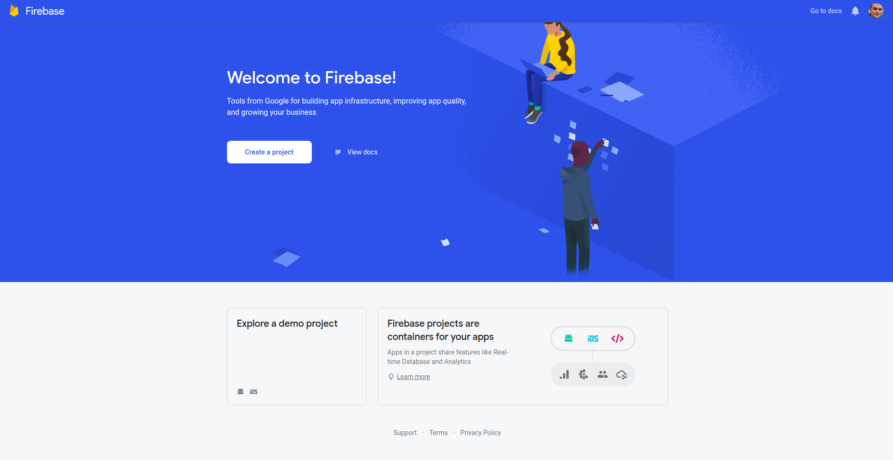
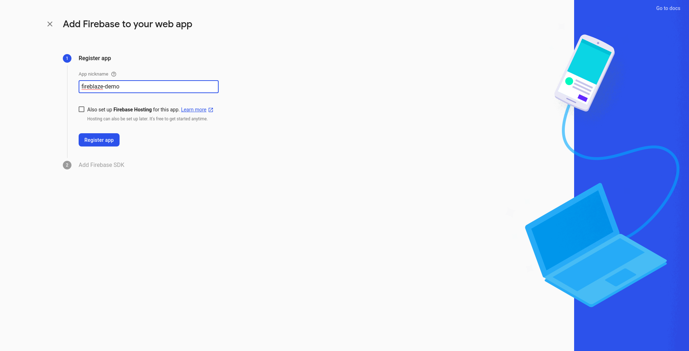
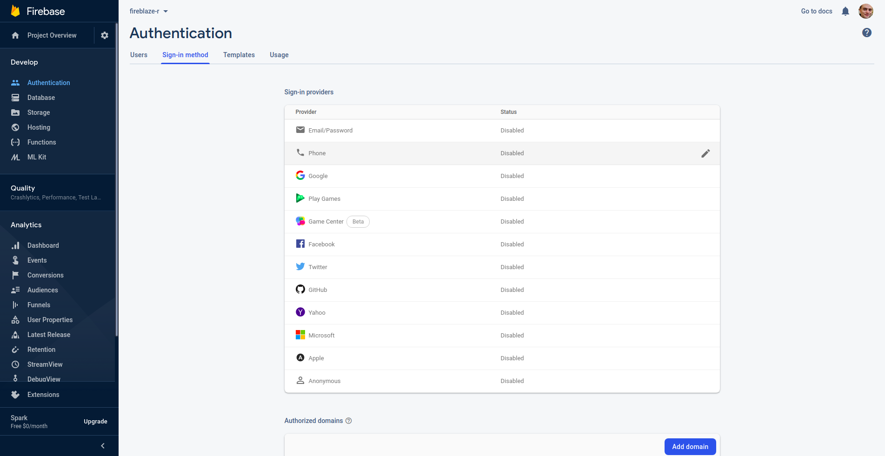

# Get Started

The {firebase} package lets you create mechanisms to authenticate Shiny users. It does so by wrapping the [Firebase](https://firebase.google.com/) interface by Google. This probably raises a first question, is it free? The answer to which is, this package only features the free functionalities which should, for now, probably fulfil most Shiny developers' needs.

!!! note "Skip Ahead"
	In this first section we create a 
	[Google Firebase](https://firebase.google.com) project, 
	if you know how to do this or already have one, skip to the
	[package configuration](#configuration) section.

## Create a Project

First, create a Google firebase account if you do not already have one; head to [firebase.google.com](https://firebase.google.com/), and set up your account. Once this done you will be presented with the screen below.

First step, hit that large white button reading "Create a project," then give your project a name.

Second step, either leave Google Analytics enabled to integrate your project with it or disable it. If confused, disable it, this can always be enabled later.

After that you should be done and eventually, after an intermediary screen, be presented with the project screen (below). Click the "web" icon (highlighted in red). 

On the next screen name your app, then hit "Register app". This might be confusing, a project will share sign-in users but may be comprised of different apps (iOS, web, etc.)

On the next screen simply hit "Continue to console," you should not be concerned with any of the code presented, {firebase} takes care of it for you. This will lead you straight into the project you have just created. 

## Define Methods

Visit "Authentication" the left sidebar then click the most prominent button that reads "Set up sign-in method."

This screen lets you set-up which authentication methods you want to provide. Some only require a click, others need to be integrated with third-party services, all of which are very straightforward. We will begin with the easier ones: email & password, and Google. This is will let users sign in by entering their email and password or using their Google account.

Click Email/password then the first enable button at the top. We will cover the second option later on. The first will require the user to enter their email and password, the second will users a sign-in link via email, thereby removing the need for a password. Then enable Google (form below).

Fill the form as you see fit, don't forget to toggle "enable" unlike I did above, and click save.

Finally set the redirect URLs, these are the URLs to which the user can be redirected after authenticating, add your `localhost` and or `127.0.0.1` so that your application can be tested locally. You will eventually have to add the URL of your the application(s).

